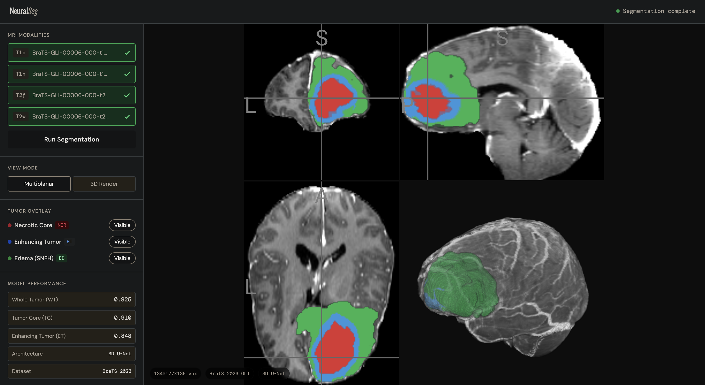
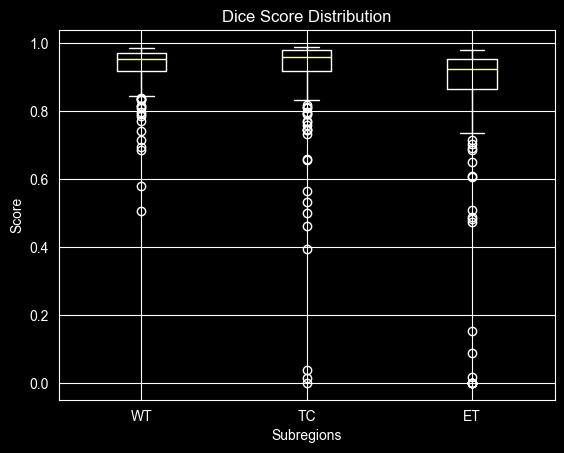

# Brain Tumor Segmentation — BraTS 2023

3D brain tumor segmentation on multimodal MRI data using MONAI and PyTorch, with a full MLOps pipeline including experiment tracking, CI/CD, containerized inference, and an interactive 3D demo.

---

## Demo

🔗 **[Live Demo — Hugging Face Spaces](https://huggingface.co/spaces/AndrewVFranco/NeuralSeg)**

Upload any BraTS-format MRI volume and visualize predicted tumor subregion masks interactively across axial, coronal, and sagittal planes.



---

## Results

Evaluated on 188 held-out BraTS 2023 GLI test cases. Metrics computed using standard image-level Dice and Hausdorff95.

| Subregion | Dice ↑ | HD95 (mm) ↓ |
|---|---|---|
| Whole Tumor (WT) | **0.930** | **5.94** |
| Tumor Core (TC) | **0.910** | **3.76** |
| Enhancing Tumor (ET) | **0.848** | **3.23** |

### Leaderboard Comparison

| Model                         | WT Dice | TC Dice | ET Dice | WT HD95 | TC HD95 | ET HD95 |
|-------------------------------|---|---|---|---|---|---|
| **This Model (3D U-Net)**     | **0.930** | **0.910** | **0.848** | **5.94** | **3.76** | **3.23** |
| BraTS 2023 Winner (ensemble)† | 0.901 | 0.867 | 0.851 | 14.94 | 14.47 | 17.70 |
| KLE-based SOTA (2024)†        | 0.929 | — | — | 2.93 | 6.78 | 10.35 |

† Challenge entries report lesion-wise metrics which penalize missed lesions and false positives, resulting in lower scores than the standard image-level metrics used here.

### Dice Score Distribution



Full evaluation details and qualitative visualizations in [`notebooks/02_evaluation.ipynb`](notebooks/02_evaluation.ipynb).

---

## Overview

This project trains a 3D U-Net on the BraTS 2023 GLI dataset to segment brain tumor subregions from multimodal MRI volumes. The model predicts three clinically meaningful subregions:

- **Whole Tumor (WT)** — full tumor extent (labels 1 + 2 + 3)
- **Tumor Core (TC)** — necrotic core and enhancing tissue (labels 1 + 3)
- **Enhancing Tumor (ET)** — actively growing tumor region (label 3)

Beyond model training, the project implements a production-style MLOps pipeline: experiment tracking with MLflow, automated CI/CD via GitHub Actions, containerized inference via Docker, and a publicly accessible live demo.

---

## Architecture

- **Model:** 3D U-Net with residual connections (MONAI)
- **Input:** 4-channel multimodal MRI volume (T1, T1ce, T2, FLAIR), skull-stripped and intensity normalized
- **Output:** 3-class voxel-wise segmentation mask (WT / TC / ET)
- **Loss:** Dice loss + cross-entropy (combined)
- **Inference:** Sliding window inference with 128³ ROI over full volume

---

## Project Structure

```
brats-tumor-segmentation/
├── .github/workflows/      # GitHub Actions CI/CD (ci.yml)
├── checkpoints/            # Saved model weights (best_model.pth)
├── configs/                # YAML training configuration
├── data/                   # gitignored — BraTS NIfTI volumes
│   ├── raw/                # original downloaded volumes
│   ├── processed/          # skull-stripped, normalized volumes
│   └── splits/             # train/val/test split definitions
├── docker/                 # Dockerfile + .dockerignore
├── notebooks/
│   ├── figures/            # saved evaluation plots
│   ├── 01_data_exploration.ipynb
│   └── 02_evaluation.ipynb
├── src/
│   ├── inference/          # sliding window inference, FastAPI endpoint
│   ├── interface/          # NiiVue 3D viewer (index.html + sample cases)
│   ├── preprocessing/      # skull stripping, normalization, split creation
│   ├── training/           # model, dataloader, transforms, training loop
│   └── utils/              # data download, manifest utilities
├── tests/                  # pytest unit tests
├── .env
├── pyproject.toml
├── requirements.txt
└── README.md
```

---

## MLOps Pipeline

| Component | Tool | Details |
|---|---|---|
| Experiment tracking | MLflow | Logs hyperparameters, per-epoch metrics, and segmentation visualizations as artifacts |
| Model registry | MLflow | Version tags with metric annotations |
| CI/CD | GitHub Actions | Linting, unit tests, and model checks on every PR |
| Containerization | Docker | Reproducible inference environment |
| Deployment | Hugging Face Spaces | Publicly accessible live demo |

---

## Setup & Reproducibility

### Requirements

- Python 3.11
- See `requirements.txt` for full dependency list

### Installation

```bash
git clone https://github.com/AndrewVFranco/brats-tumor-segmentation.git
cd brats-tumor-segmentation
python3.11 -m venv .venv
source .venv/bin/activate
pip install -r requirements.txt
```

### Data

Download BraTS 2023 GLI data from [Synapse](https://www.synapse.org/) (free registration required). Place volumes in `data/raw/`. See `notebooks/01_data_exploration.ipynb` for expected directory structure.

### Training

```bash
python src/training/train.py --config configs/train_config.yaml
```

### Inference

```bash
python src/inference/predict.py --input path/to/volume.nii.gz --output path/to/output/
```

### Docker

```bash
docker build -f docker/Dockerfile -t brats-inference .
docker run -p 8000:8000 brats-inference
```

---

## Dataset

**BraTS 2023 GLI** (Brain Tumor Segmentation Challenge — Glioma)
- Hosted via Synapse (RSNA-ASNR-MICCAI)
- ~1,200 multimodal MRI cases with expert annotations
- Four MRI modalities per case: T1, T1ce, T2, FLAIR
- Labels: 0 — background, 1 — necrotic core, 2 — peritumoral edema, 3 — enhancing tumor

---

## Background

Developed as a portfolio project demonstrating full-stack ML engineering in clinical medical imaging. Informed by 8+ years of clinical experience in cardiac telemetry monitoring, with real-world awareness of clinical workflow constraints, alarm fatigue, and patient safety considerations that are often absent from purely academic implementations.

---

## License

MIT License — see `LICENSE` for details.